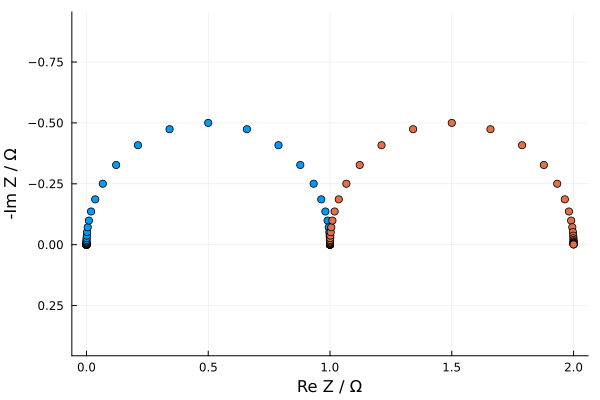
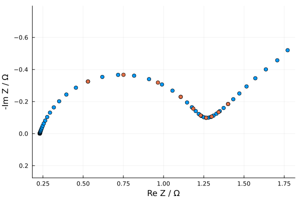

# Tutorial


```julia
using EISAnalysis
```

## Circuit Elements

This package includes Resistors, Capacitors, CPEs, Inductors, and Warburgs which can be called through the following variables:

`r, c, q, l, wo, ws`

with default parameter values. They are all `CircuitElement` types. Here let's call a resistor and a capacitor


```julia
r
```


    EISAnalysis.Resistor(1.0, Real[100000.0, 71968.5673001152, 51794.746792312115, 37275.9372031494, 26826.957952797256, 19306.977288832502, 13894.954943731376, 10000.0, 7196.85673001152, 5179.474679231211  …  0.019306977288832503, 0.013894954943731377, 0.01, 0.007196856730011521, 0.005179474679231211, 0.00372759372031494, 0.002682695795279726, 0.0019306977288832503, 0.0013894954943731376, 0.001], ComplexF64[1.0 + 0.0im, 1.0 + 0.0im, 1.0 + 0.0im, 1.0 + 0.0im, 1.0 + 0.0im, 1.0 + 0.0im, 1.0 + 0.0im, 1.0 + 0.0im, 1.0 + 0.0im, 1.0 + 0.0im  …  1.0 + 0.0im, 1.0 + 0.0im, 1.0 + 0.0im, 1.0 + 0.0im, 1.0 + 0.0im, 1.0 + 0.0im, 1.0 + 0.0im, 1.0 + 0.0im, 1.0 + 0.0im, 1.0 + 0.0im])


```julia
c
```


    EISAnalysis.Capacitor(1.0, Real[100000.0, 71968.5673001152, 51794.746792312115, 37275.9372031494, 26826.957952797256, 19306.977288832502, 13894.954943731376, 10000.0, 7196.85673001152, 5179.474679231211  …  0.019306977288832503, 0.013894954943731377, 0.01, 0.007196856730011521, 0.005179474679231211, 0.00372759372031494, 0.002682695795279726, 0.0019306977288832503, 0.0013894954943731376, 0.001], ComplexF64[0.0 - 1.0e-5im, 0.0 - 1.3894954943731376e-5im, 0.0 - 1.93069772888325e-5im, 0.0 - 2.682695795279726e-5im, 0.0 - 3.72759372031494e-5im, 0.0 - 5.179474679231211e-5im, 0.0 - 7.196856730011521e-5im, 0.0 - 0.0001im, 0.0 - 0.00013894954943731376im, 0.0 - 0.00019306977288832504im  …  0.0 - 51.79474679231211im, 0.0 - 71.9685673001152im, 0.0 - 100.0im, 0.0 - 138.94954943731375im, 0.0 - 193.06977288832502im, 0.0 - 268.2695795279726im, 0.0 - 372.759372031494im, 0.0 - 517.947467923121im, 0.0 - 719.685673001152im, 0.0 - 1000.0im])


Each circuit element stores a frequency vector `ω` and its AC impedance `Z` over that frequency.

Now we can generate all kinds of circuits, which themselves are also `CircuitElement` types


```julia
series_circuit = r-c
parallel_circuit = r/c
combined_circuit = r-r/c #can also by constructed by combined_circuit = r-parallel_circuit
```


    EISAnalysis.Circuit(Real[100000.0, 71968.5673001152, 51794.746792312115, 37275.9372031494, 26826.957952797256, 19306.977288832502, 13894.954943731376, 10000.0, 7196.85673001152, 5179.474679231211  …  0.019306977288832503, 0.013894954943731377, 0.01, 0.007196856730011521, 0.005179474679231211, 0.00372759372031494, 0.002682695795279726, 0.0019306977288832503, 0.0013894954943731376, 0.001], ComplexF64[1.0000000001 - 9.999999999e-6im, 1.0000000001930698 - 1.389495494104868e-5im, 1.0000000003727594 - 1.9306977281635643e-5im, 1.0000000007196856 - 2.6826957933490283e-5im, 1.0000000013894954 - 3.727593715135466e-5im, 1.0000000026826958 - 5.179474665336256e-5im, 1.0000000051794746 - 7.196856692735584e-5im, 1.00000001 - 9.999999900000002e-5im, 1.000000019306977 - 0.000138949546754618im, 1.000000037275936 - 0.0001930697656914686im  …  1.9996273795257427 - 0.01929978311379866im, 1.9998069674958532 - 0.013892272765783583im, 1.999900009999 - 0.00999900009999im, 1.9999482079357644 - 0.007196483989945467im, 1.9999731737617137 - 0.0051793357334092675im, 1.9999861052381234 - 0.003727541926287823im, 1.9999928031950645 - 0.0026826764884413856im, 1.9999962724201745 - 0.0019306905320533472im, 1.9999980693059989 - 0.001389492811682522im, 1.999999000001 - 0.000999999000001im], Expr[:(1.0r), :(1.0r), :(1.0c)], Function[-, /], [2, 1], [1, 1, 1])


You can easily plot circuits using the `plot_Nyquist` function


```julia
plt = plot_Nyquist(parallel_circuit,combined_circuit)
```
 


You can also set the parameters of your circuit in the following way


```julia
combined_circuit2 = 0.2r-1.5r/1e-02c
combined_circuit3 = 0.4r-r/5c
plot_Nyquist(combined_circuit2,combined_circuit3,label = ["circuit 1", "circuit 2"])
```

 


The full list of default circuit element parameters are as follows:

    Resistor()      = 1.0r
    Capacitor()     = 1.0c
    Inductor()      = 1.0l
    CPE()           = 1.0q^0.8
    Warburg("short")= 1.0ws^1.0
    Warburg("open") = 1.0wo^1.0

On top of parameters, these structs hold the complex AC impedance `Z` as well as the frequencies `ω` over which `Z` is evaulated

## Circuits

Circuits, which are constructed from circuit elements, store `ω` and `Z`. But they also contain the list of element expressions and operators which comprise the circuit. This enables circuits to be freely manipulated by changing parameters or changing the range of frequencies over which the impedance is calculated. Below is a quick demonstration of the ability to manipulate circuit parameters.


```julia
circuit = 0.23r-(r-0.025wo^80)/0.2q 
print_circuit(circuit)
```

    0.23r
    1.0r
    0.025 * wo ^ 80.0
    0.2 * q ^ 0.8


```julia
using EISAnalysis: get_params,set_params
p = get_params(circuit)
```
    4-element Vector{Any}:
     0.23
     1.0
      (0.025, 80.0)
      (0.2, 0.8)


```julia
p[1] = 0.5
updated_circuit = set_params(circuit,p)
print_circuit(updated_circuit)
plot_Nyquist(circuit,updated_circuit)
```

    0.5r
    1.0r
    0.025 * wo ^ 80.0
    0.2 * q ^ 0.8


 


Furthermore, when fitting to experimental data, the `~` operator has been overloaded to do just that.


```julia
ω_data = collect(logrange(1e-02,1e01,10))
updated_circuit2 = circuit ~ ω_data
plot_Nyquist(circuit,updated_circuit2)
```


 


## Circuit Fitting

This package uses LsqFit.jl to optimize circuit parameters to fit to data. The `Circuit` functionalities above make it easy to build custom circuit models. Let's take an example here using Li-ion EIS data found from Mendeley Data.


```julia
#Here is some raw LiB EIS data from Mendeley Data
using CSV,DataFrames,Plots
ω_exp =  [ 0.05, 0.1, 0.2, 0.4, 1, 2, 4, 10, 20, 40, 100, 200, 400, 1000]
data = CSV.read("Data/EIS_Data.csv",DataFrame)
Z_exp = data[!,"Re(Z)"]-im*data[!,"-Im(Z)"]
plt =scatter(Z_exp,label = "data",aspect_ratio=:equal)
plot!(plt,ylims = (-0.01,0),yflip=true)
```


This data can be fit in many ways. The commonly-chosen model here is a Randles circuit. The initial guess of parameters is written directly the circuit definition.


```julia
randles_circuit = 0.045r-(0.02r-0.001wo^25)/2q 
plt =scatter(Z_exp,label = "data")
plot_Nyquist!(plt,randles_circuit~ω_exp;label = "initial guess")
display(plt)
```


```julia
fit = circuit_fit(randles_circuit,ω_exp,Z_exp)
```

    Parameters
    __________
    0.046027r
    0.021282r
    0.0010941 * wo ^ 21.839
    4.0056 * q ^ 0.65659


    EISAnalysis.Circuit(Real[0.05, 0.1, 0.2, 0.4, 1.0, 2.0, 4.0, 10.0, 20.0, 40.0, 100.0, 200.0, 400.0, 1000.0], ComplexF64[0.07061179523546973 - 0.0036161366757002586im, 0.06954307187666481 - 0.0026715521535557504im, 0.06874379564835513 - 0.0020763517117051954im, 0.06810812559118191 - 0.0017552263613986026im, 0.06736749739341655 - 0.0017060927852878705im, 0.066764686487546 - 0.0019573565714202266im, 0.06599895839171742 - 0.0024813832147565526im, 0.06446508247644935 - 0.0036020266237018496im, 0.06265958883350577 - 0.004664502602918982im, 0.06015344812037913 - 0.005620471222819887im, 0.05606188291759614 - 0.006049061177104257im, 0.053034945917901526 - 0.005501458630241011im, 0.05060616191363954 - 0.004454884628732528im, 0.048497540869868086 - 0.0029615176982271175im], Any[:(0.046027r ~ [0.05, 0.1, 0.2, 0.4, 1.0, 2.0, 4.0, 10.0, 20.0, 40.0, 100.0, 200.0, 400.0, 1000.0]), :(0.021282r ~ [0.05, 0.1, 0.2, 0.4, 1.0, 2.0, 4.0, 10.0, 20.0, 40.0, 100.0, 200.0, 400.0, 1000.0]), :(0.0010941 * wo ^ 21.839 ~ [0.05, 0.1, 0.2, 0.4, 1.0, 2.0, 4.0, 10.0, 20.0, 40.0, 100.0, 200.0, 400.0, 1000.0]), :(4.0056 * q ^ 0.65659 ~ [0.05, 0.1, 0.2, 0.4, 1.0, 2.0, 4.0, 10.0, 20.0, 40.0, 100.0, 200.0, 400.0, 1000.0])], Function[-, -, /], [3, 1, 2], [1, 1, 1, 1])


Whether a randles circuit is the best model for this particular dataset is a different story. This same data can be fit using `compute_drt()`, which is demonstrated in the DRT notebook.
